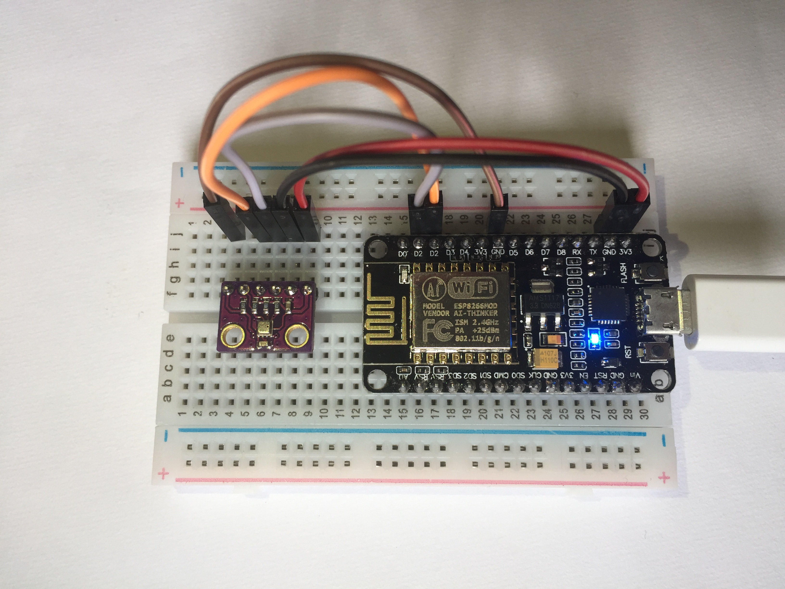
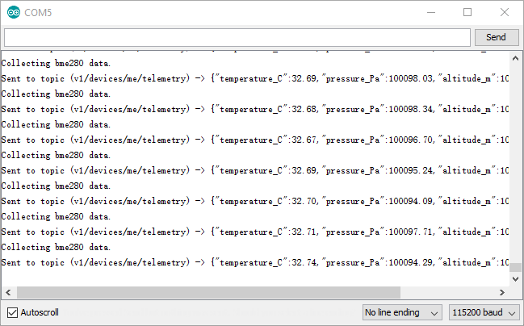
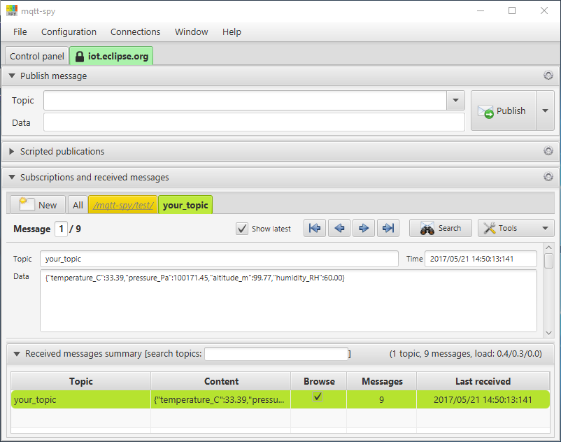
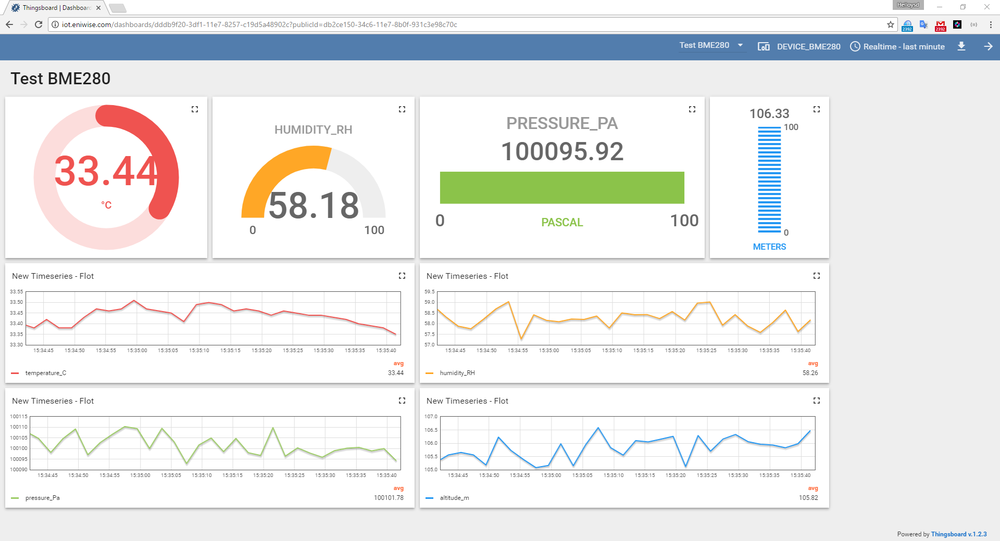

ESP8266 MQTT BME280 Demo
============
A minimal viable package to demo how to use esp8266 core module and BME280 environmental sensor.

## Hardware setup (NodeMCU ESP-12E)

## Software setup (Arduino)
Prerequisites:
1. Install [Arduino](https://www.arduino.cc/en/main/software) version 1.6.13
2. Install [esp8266 platform](https://github.com/esp8266/Arduino) through Boards Manager
3. Install [SparkFun BME280 Arduino Library](https://github.com/sparkfun/SparkFun_BME280_Arduino_Library)

Clone the demo code from [here](https://github.com/gavinying/esp-demo.git), change the WiFi settings and run in Arduino IDE.

Arduino console output

Test with mqtt-spy

Test with Thingsboard

